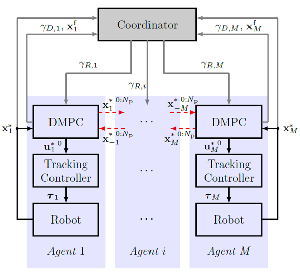

<h1>
  <a href="#"></a>
</h1>

<p>
  <a href="https://mv.rptu.de/fgs/wskl/forschung/kokobot" alt="Documentation">
    
  </a>
  <a href="https://opensource.org/license/mit/" alt="License">
    
  </a>
</p>

## Introdcution

**KoKoBot** stands for Cooperative and Collaborative Robotplatform.  KoKoBot automates optimal task planning, online trajectory planning, and collision avoidance for robots operating in dynamic surroundings, creating a safe and collaborative workplace for both robots and humans. By embracing KoKoBot, industries can unlock a new level of operational efficiency and safety, enabling optimal task execution, collision-free navigation, and harmonious collaboration between robots and human workers. The integration of the robot operating system (ROS) further enhances KoKoBot’s communication, performance and adaptability.


This repository contains an implementation of optimal task execution and collision avoidance using distributed model predictive control (**DMPC**). It ensures efficient trajectory planning and safe navigation for robots by considering their predictive dynamic path with other robot's planned path. Communication between DMPCs is achieved through the Robot Operating System (ROS), enabling coordination among multiple robots.

### Structure
The system possesses the ability to dynamically adapt and adjust trajectories in real-time, allowing it to respond effectively to environmental changes and uncertainties. Additionally, the control scheme supports multiple robots, allowing for cooperative operation as depicted in the provided picture. 


<p align="center">
   
</p>


### Videos

#### Simulation

The following videos are simulated using gazebo. They represent the case how the algorithm can be expanded to larger system and two more number of robots. They are picking, sorting and placing the objects.

structure of 2 robots | structure of 3 robots | strucutre of 4 robots
:-: | :-: | :-:
<video src="doc/Simulation2Roboter.mp4" controls title="Title"></video> | <video src="doc/Simulation3Roboter.mp4" controls title="Title"></video> | <video src="doc/Simulation4Roboter.mp4" controls title="Title"></video>

#### Hannover Messe 2023
The KoKoBot has participated in the Hannover messe that took place in April 2023 in Hannover, Germany. The following video shows the diassembly process of the 3 trucks with two UR5e robots.

<p align="center">
<video controls="true" src='doc/first_use_case.mp4' type="video/mp4" width=500/>
</p>

## Documentation

KoKoBot's documentation and information is available at [WSKL-Website](https://mv.rptu.de/fgs/wskl/forschung/kokobot).


## Installation

### Prerequisites

- Ubuntu: 20.04 (preferred). 
- ROS: [Noetic](http://wiki.ros.org/noetic/Installation/Ubuntu)
- Universal robot gazebo simulation: [universal_robot](https://github.com/dhled/universal_robot)
- Universal Robots ROS drivers (necessary for the Hardware): [Universal_Robots_ROS_Driver](https://github.com/UniversalRobots/Universal_Robots_ROS_Driver).
- Robotiq 2f-85 gripper: [robotiq](https://github.com/ros-industrial/robotiq/tree/kinetic-devel)
- Inverse Kinematics for Universal robots e-series: [ur_ikfast](https://github.com/cambel/ur_ikfast)
- Python 3.8


### Python packages

Python libraries can be installed from PyPl via:
```bash
pip install casadi==3.6.3
pip install numpy==1.25.1
pip install scipy==1.7.3
```

### Building up the gazebo simulation

The following instructions assume that a [Catkin workspace](https://wiki.ros.org/catkin/Tutorials/create_a_workspace) has been created at `~/catkin_ws` and that the source space is at `~/catkin_ws/src`. Update paths appropriately if they are different on the build machine.

In all other cases the packages will have to be build from sources in a Catkin workspace:

```bash
# retrieve the sources
git clone https://github.com/ngafur/kokobot_OS

sudo mv ~/kokobot_OS/gazeboWorld ~/carkin_ws/src

cd ~/catkin_ws/src

cd ~/catkin_ws

# checking dependencies (again: replace '$ROS_DISTRO' with the ROS version you are using)
rosdep update
rosdep install --rosdistro $ROS_DISTRO --ignore-src --from-paths src

# building
catkin_make

# activate this workspace
source ~/catkin_ws/devel/setup.bash
```
replace $ROS_DISTRO with Noetic, Melodic or kinetic, depending on which ROS version you have installed.

### Preparing the solver
The algorithm is using Casadi with ipopt as NLP solver, you need to define the ipopt by youself. Check this [Link](https://coin-or.github.io/Ipopt/OPTIONS.html).


## Getting Started

To run the code:

1- **Run the ROS-Master**. Actullay it is preferable to run ros-master through following command, otherwise roslaunch can be suffient.

```bash
roscore 
```

2- **Run the gezboo simulation**
after the installation of universal robot UR5e and robotiq gripper for two robots. 

```bash
roslaunch ur_e_gazebo ur5e.launch
```
3- **Run the Online trajectory planner using DMPC algorithm for two robots.**

1. First you need to open the right directory

```bash
cd ~/kokobot_OS/onlineTrajectoryPlanner
``` 

2. Start Coodinator and wait for "Waiting for start message":
```bash
python3 Coordinator.py
``` 

3. Inititalize robot (30) and wait for "Waiting for start message": 
```bash
python3 main_robot_ROS_R1.py
``` 

4. Inititalize robot (29) and wait for "Waiting for start message": 
```bash
python3 main_robot_ROS_R2.py
```

5. Synchronized Start:
```bash
python3 startSynchronized.py
```

The terminal will ask to enter "go". This must be done twice. First go will start a calculation of the trajectory and the terminal windows of the main_robot... script will output "Solve_Succeeded; Waiting for start message.". Then you can enter "go" the second time which will start the pick and place algorithm.


## Citation

If you are use Online Trajector Planner for published research, please cite:

```
@inproceedings{Gafur.2021,
 author = {Gafur, Nigora and Yfantis, Vassilios and Ruskowski, Martin},
 title = {Optimal scheduling and non-cooperative distributed model predictive control for multiple robotic manipulators},
 pages = {390--397},
 publisher = {IEEE},
 isbn = {978-1-6654-1714-3},
 booktitle = {2021 IEEE/RSJ International Conference on Intelligent Robots and Systems (IROS)},
 year = {2021},
 doi = {10.1109/IROS51168.2021.9636118 }
}
```

```
@incollection{Gafur.2022,
 author = {Gafur, Nigora and Weber, Leo and Yfantis, Vassilios and Wagner, Achim and Ruskwoski, Martin},
 title = {Dynamic path planning and reactive scheduling for a robotic manipulator using nonlinear model predictive control},
 pages = {604--611},
 year = {2022},
 doi = {10.1109/MED54222.2022.9837147}
}
```
```
@article{Gafur.2022b,
 author = {Gafur, Nigora and Kanagalingam, Gajanan and Wagner, Achim and Ruskowski, Martin},
 year = {2022},
 title = {Dynamic Collision and Deadlock Avoidance for Multiple Robotic Manipulators},
 url = {https://kluedo.ub.rptu.de/frontdoor/index/index/docId/7098},
 keywords = {collision avoidance;deadlock;distributed model predictive control;motion control;multiple robotic manipulators;robotic manipulators;ROS},
 number = {10, 2022, 55766 - 55781},
 issn = {2169-3536},
 journal = {IEEE Access},
}
```


## License and Disclaimer

Copyright 2023 RPTU.

Source code is licensed under the MIT License. You may obtain a
copy of the License at https://opensource.org/license/mit/

This repository is maintained by [Nigora Gafur](https://github.com/ngafur) &  [Khalil Abuibaid](https://github.com/abuibaid).


